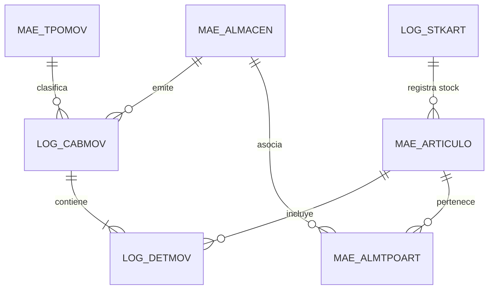
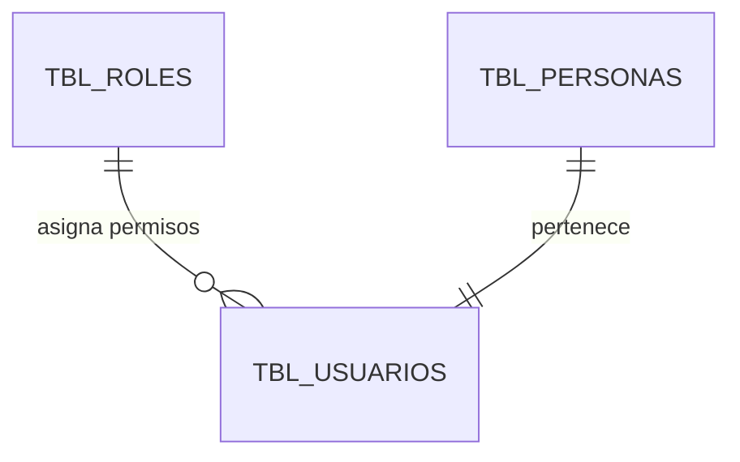

# Esquema de Bases de Datos Híbrido: SQL Server ERP + MySQL

**SIGRIS** se apoya en dos motores de bases de datos complementarios para separar los datos transaccionales del ERP de la gestión de identidades y seguridad.

---

## 📌 Relaciones y Dependencias
- **Consultado por Endpoints:** [[Backend/Doc_API_Endpoints_JSON]].
- **Seguridad de Usuarios:** [[Backend/Doc_Seguridad_BCRYPT]].
- **Vistas en Frontend:** [[Frontend/Doc_Componentes_Angular]].
- **Arquitectura de Conexión Dual:** [[Arquitectura/Arquitectura_Angular22_PHP]].

---

## 🗄️ 1. Base de Datos ERP: SQL Server (`TECNOTEST`)

Alberga la lógica de negocio, inventarios, notas de salida y catálogos de almacén.

### Tablas Principales:
1. **`mae_almacen`**:
   - `alm_codigo`: Código de almacén (`001`, `002`, `016`, etc.).
   - `alm_nombre`: Nombre oficial (`ALMACEN VERDE MP`, `ALMACEN PRODUCTOS TERMINADOS`, `ALMACEN PLANTA ROJA MP`).
2. **`log_cabmov`**:
   - `mov_id`: Identificador único de movimiento.
   - `mov_anho`, `mov_nmes`: Periodo anual y mensual.
   - `mov_docref`, `mov_numord`, `mov_usuario`: Metadatos de cabecera.
3. **`log_detmov`**:
   - `mov_id`, `mov_item`: Claves de detalle.
   - `art_codigo`, `lot_codigo`, `art_codref`, `mov_ctdmov`, `no_ord_tra`.
4. **`mae_tpomov`**:
   - `tmo_codigo`, `tmo_nombre`: Tipos de movimiento (`102 - TRANSFERENCIA ENTRE ALMACENES`, etc.).
5. **`mae_almtpoart`** & **`mae_articulo`**:
   - Relación por `tar_codigo` para segmentar artículos disponibles por almacén.
6. **`log_stkart`**:
   - `stk_stkart`: Stock físico en tiempo real por artículo y almacén.

---

## 🐬 2. Base de Datos de Seguridad: MySQL (`tf_almacen`)

Gestiona las cuentas de acceso, roles, personas asociadas y estados de sesión.

### Tablas Principales:
1. **`tbl_usuarios`**:
   - `id_usuario`: Clave primaria autoincremental.
   - `username`: Nombre de usuario único.
   - `password`: Hash criptográfico BCRYPT de 60 caracteres (ver [[Backend/Doc_Seguridad_BCRYPT]]).
   - `id_rol`: `1` (Administrador) o `2` (Usuario).
   - `estado`: `1` (Activo) o `0` (Inactivo).
2. **`tbl_personas`**:
   - `id_persona`, `nombres`, `apellidos`, `dni`, `correo`.
3. **`tbl_roles`**:
   - `id_rol`, `nombre_rol` (`Administrador`, `Usuario`).
